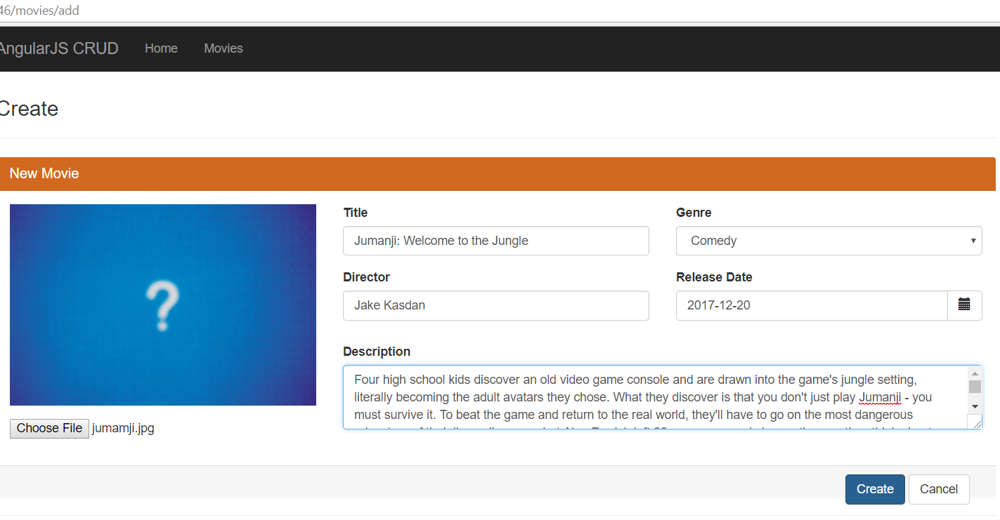
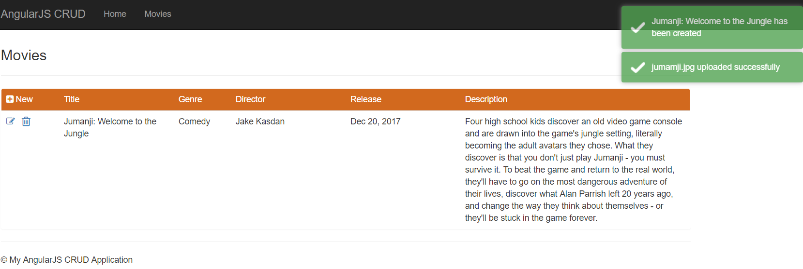
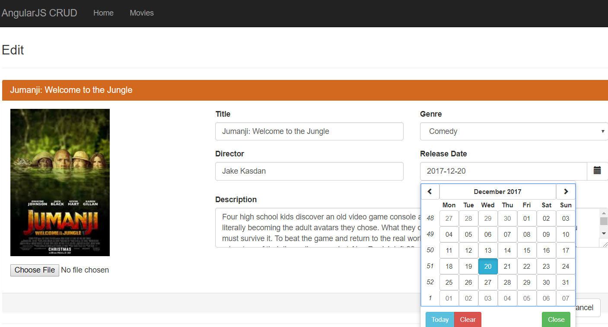
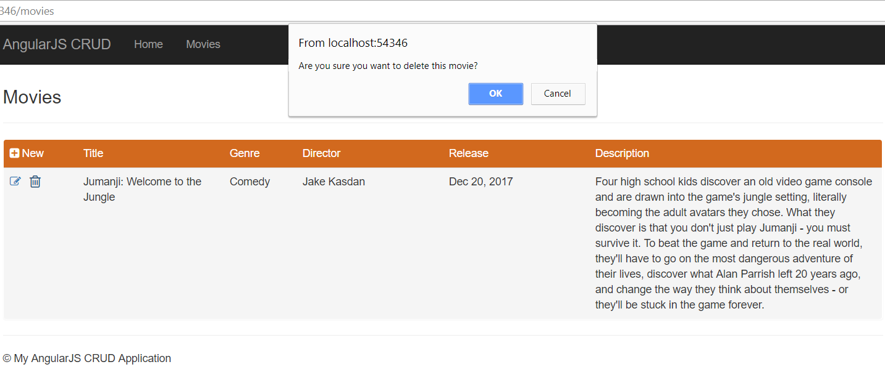

# AngularJSCRUD
AngularJS CRUD operations with .NET WebAPI simple example 

Server: (WebAPI)

- Entity Framework (Code First with Migrations)  
- AutoMapper _NuGet:_ AutoMapper
- AutoFac (Dependency Injection) _NuGet:_ Autofac.WebApi2
- CORS _NuGet:_ Microsoft.AspNet.WebApi.Cors
 
Client: (AngularJS)

- bootstrap(Style) 
- ngRoute(Routing) _NuGet:_ AngularJS.Route
- ui.bootstrap(Datepicker Calendar) _NuGet:_ Angular.UI.Bootstrap
- ngFileUpload(Upload and download files (images) to and from the server) _NuGet:_ angular-file-upload
- toastr(Notifications) _NuGet:_ toastr

To have the database in Sql Server:

- In Visual Studio, click on Tools -> NuGet Package Manager -> Package Manager Console. 
- Select WebAPI in Default project dropdownlist.
- Type update-database.

Screenshots:
- Create

- Read

- Update

- Delete

